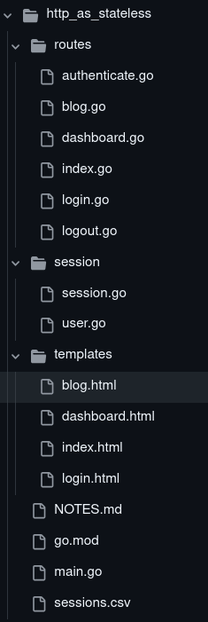

### HTTP and Statelessness

#### Stateless?

HTTP is stateless, meaning each request is independent. For example, if you visit `/about` and then `/blog`, the server doesn't remember your first request when handling the second. This is by design—it doesn't track previous requests.

#### Why Make It Stateful?

Imagine trying to access a `/dashboard` that requires login. Without remembering your login status, you'd have to log in each time. This would be repetitive and frustrating. To improve user experience, HTTP allows ways to "remember" the user’s state, such as using **cookies**. Cookies store small bits of information to help the server recognize the user, so they don’t need to log in again.

#### What We'll Cover

We’ll show how the server can remember the user using cookies. The server generates a token, stores it in a CSV file, and sends it to the browser as a cookie after login. The browser sends the cookie back with each subsequent request, allowing the server to remember the user.

This example helps you understand how HTTP’s stateless nature works and how HTTP headers manage client-server communication.

---

### Internals

The project has three main directories:

- **routes**: Contains HTTP handlers for the endpoints.
- **templates**: Holds HTML files used as views by the handlers.
- **session**: Manages the user session, storing a token in a file once authenticated.

**Key Files:**

- **routes/login.go**: Handles the login form (from `templates/login.html`) and redirects the user to the dashboard after login.
- **routes/authenticate.go**: Processes user login data, generates a token, stores it in `sessions.csv`, and sends the token to the client as a cookie. The client sends this cookie with every subsequent request, allowing the server to remember the user.

Other files show the difference between a logged-in user and a guest. Authenticated users are addressed by their name (like on `/dashboard` and `/blog`), while guests are treated as anonymous.

---

This application demonstrates HTTP's stateless nature. Without cookies, each request is independent, and the user is always a guest. When a user logs in, the server can remember them by receiving a token with each request, confirming their state. This concept can be used to introduce statefulness in applications that need small amounts of data between requests.